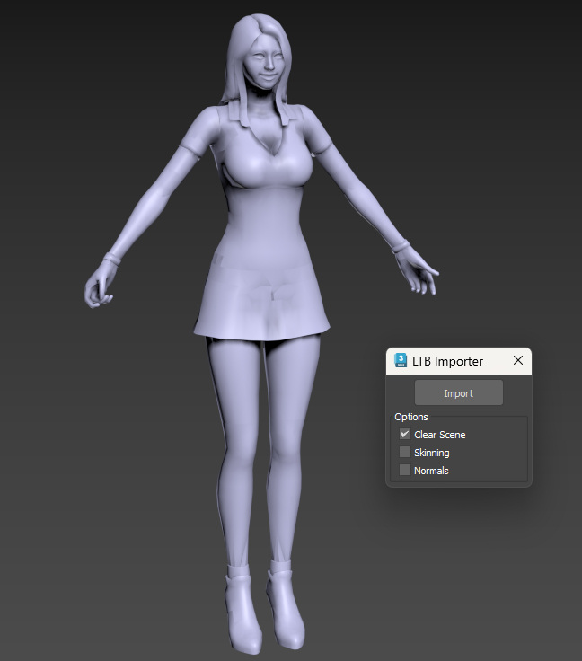

# Sudden Attack LTB Importer for 3ds Max

This script is a **3ds Max MaxScript** designed to import 3D models from the mobile game **Sudden Attack**. It reads models stored in the **LithTech Binary (LTB)** file format and reconstructs them within 3ds Max, including bone structures and skinning information.

## Features

- **Import LTB Models**: Load and parse models from LTB files used in Sudden Attack.
- **Bone Reconstruction**: Rebuilds the bone hierarchy from the model data.
- **Skinning Support**: Optionally applies skinning to meshes using imported bone weights.
- **Normals Import**: Optionally imports and applies vertex normals to meshes.
- **Multiple LODs**: Supports models with multiple Levels of Detail (LODs).

## Limitations

- **Materials and Textures Not Supported**: The script does not import materials or textures due to the absence of this data in the provided samples.
- **Partial File Specification**: Some parts of the LTB file format are not fully understood, which may lead to issues with certain files.
- **Potential Crashes**: Some files might cause 3ds Max to crash if they contain unexpected data or unsupported features.

## Installation

1. Save the script with a `.ms` extension.
2. Open 3ds Max.
3. Go to **MaxScript > Run Script...**.
4. Select the saved script file.

## Usage

1. After running the script, a dialog named **LTB Importer** will appear.
2. **Options**:
   - **Clear Scene**: Clears the current scene before importing (default: checked).
   - **Skinning**: Imports skinning data and applies it to the mesh (default: unchecked).
   - **Normals**: Imports and applies vertex normals (default: unchecked).
3. Click the **Import** button.
4. Select the `.ltb` file you wish to import.
5. The model will be imported into the scene based on the selected options.

## Notes

- The script checks for known 3ds Max viruses and provides a warning if detected.
- Bone names may be automatically renamed to match standard naming conventions.
- If the script encounters unsupported vertex strides or unknown data, it may exit or produce incomplete models.

## Troubleshooting

- **Unsupported Vertex Stride**: If you receive an error about an unsupported vertex stride, the script encountered an unknown vertex format. This may require updating the script to handle new formats.
- **Crashes or Errors**: Ensure you are importing compatible LTB files from Sudden Attack. Some files may contain unsupported data structures.
- **No Geometry Imported**: Verify that the LTB file contains mesh data and that the **Clear Scene** option is not removing existing geometry unintentionally.
